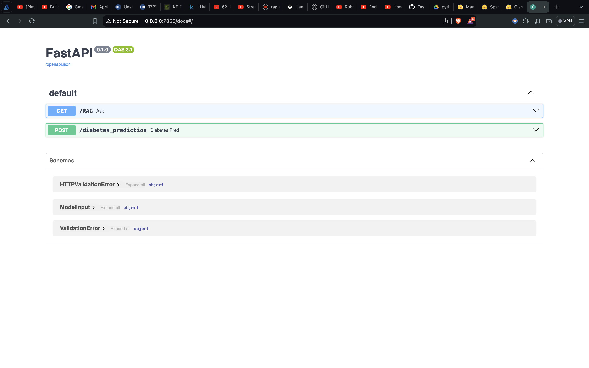
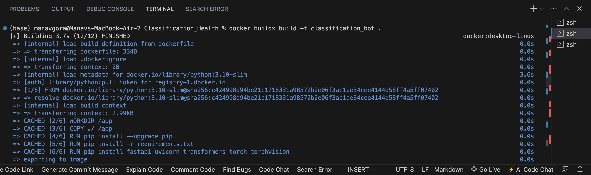
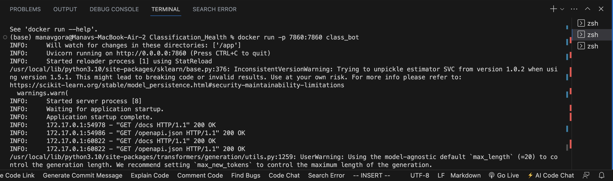
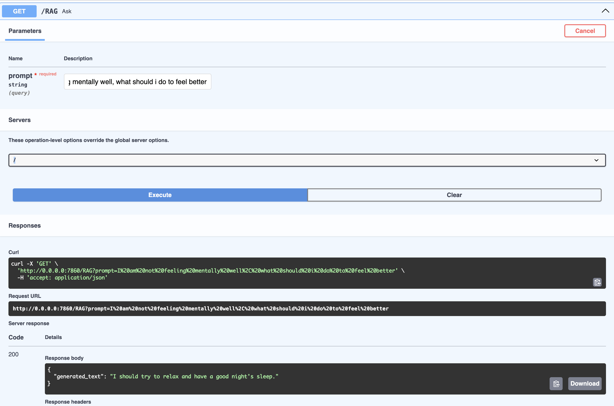
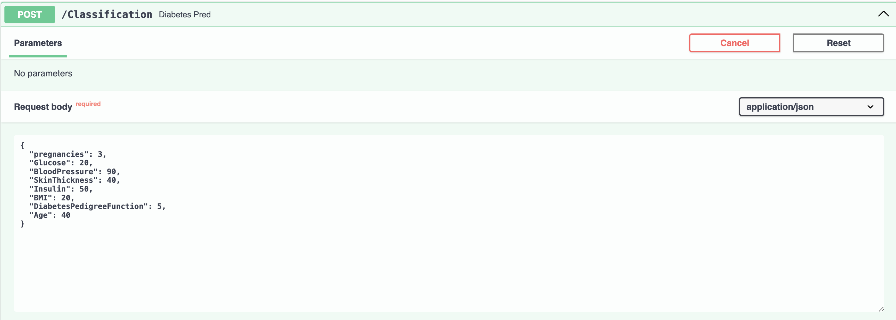
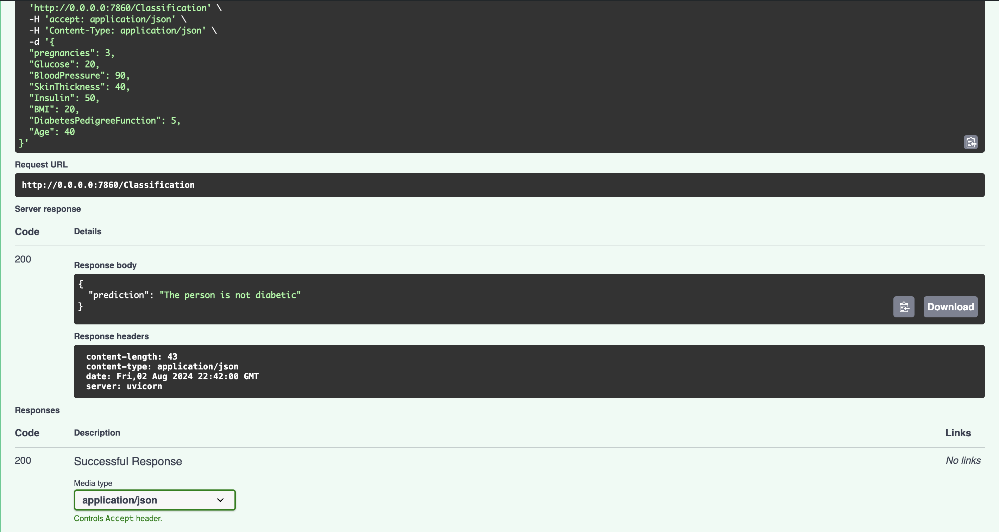

# Mental Health Chatbot & Diabetes Classification API
<br>



<br>

This project provides a FastAPI server with two distinct endpoints:
- `/RAG`: A Retrieval-Augmented Generation (RAG) application for a mental health chatbot.
- `/Classification`: A classification model for predicting diabetes.

## Table of Contents

- [Overview](#overview)
- [Features](#features)
- [Setup Instructions](#setup-instructions)
- [Endpoints](#endpoints)
  - [/RAG](#rag)
  - [/Classification](#classification)
- [Dockerization](#dockerization)
- [Bonus Points](#bonus-points)
- [Contact](#contact)

## Overview

This project aims to:
1. Develop a FastAPI server with two endpoints.
2. Implement a RAG mechanism for a mental health chatbot using an open-source LLM.
3. Create a classification model for diabetes prediction.

## Features

- FastAPI server with two endpoints.
- Retrieval-Augmented Generation (RAG) for mental health chatbot.
- Diabetes classification using a pre-trained model.
- Dockerization for easy deployment and production.

## Setup Instructions

### Prerequisites

- Python 3.10+ 🐍
- Docker (optional but recommended) ⛴️
- FastAPI 💨
- HuggingFace 🤗 Transformers

### Clone the Repository

```bash
git clone https://github.com/yourusername/yourrepository.git
cd yourrepository
```

### Install Dependencies

```bash
pip install --upgrade pip
pip install -r requirements.txt
```

### Install Docker Desktop [here⛴️](https://docs.docker.com/get-docker/)
 
- Keep your Docker Desktop always open during the project
- Here you will create Image -> Container 
- After writing all your code, you can create an Image using :- 

```bash
docker buildx build -t <Image_Name> .
```
<br>



<br>

- For creating an Container in an Image :-

```bash
docker run -p 7860:7860 <Image_Name>
````
<br>



<br>

## Endpoints

### /RAG

- **Objective**: Build a Retrieval-Augmented Generation (RAG) application for a mental health chatbot. The chatbot provides answers based on the user's prompt.
- **Method**: GET
- **Query Parameter**: `prompt` (str) - The user's input describing their mental health issues.

<br>



<br>

Example:

Example:

```bash

curl -X GET "http://127.0.0.1:7860/RAG?prompt=I am feeling anxious"

```

Response:

```json
{
  "generated_text": "Here are some articles that might help you with anxiety..."
}
```

### /Classification

- **Objective**: Predict whether a person is diabetic based on their health parameters.
- **Method**: POST
- **Request Body**: JSON object containing the following fields:
  - `pregnancies`: int
  - `Glucose`: int
  - `BloodPressure`: int
  - `SkinThickness`: int
  - `Insulin`: int
  - `BMI`: float
  - `DiabetesPedigreeFunction`: float
  - `Age`: int

  <br>
  
  
  
  <br>

Example:

```bash
curl -X POST "http://127.0.0.1:7860/Classification" -H "Content-Type: application/json" -d '{
  "pregnancies": 2,
  "Glucose": 120,
  "BloodPressure": 80,
  "SkinThickness": 20,
  "Insulin": 85,
  "BMI": 28.1,
  "DiabetesPedigreeFunction": 0.5,
  "Age": 25
}'
```

Response:

```json
{
  "prediction": "The person is not diabetic"
}
```

<br>



<br>

## Dockerization

```bash
FROM python:3.10-slim

WORKDIR /app

COPY ./ /app

RUN pip install --upgrade pip
RUN pip install -r requirements.txt
RUN pip install fastapi uvicorn transformers torch torchvision

CMD ["uvicorn", "app:app", "--reload", "--host", "0.0.0.0", "--port", "7860"]
```


## Bonus Points

### Hugging Face Space

You can create a Hugging Face Space to demonstrate and test your models. Follow the [official guide](https://huggingface.co/spaces)🤗 to set it up.

### Optimization

To optimize the response time of your FastAPI application, consider the following:
- Use asynchronous functions where applicable.
- Optimize model loading and prediction times.
- Deploy using a production-ready server like Gunicorn with Uvicorn workers.

## Contact

For any questions or issues, please contact Manav Gora 🙋🏻‍♂️ at manavgora@gmail.com 📧

